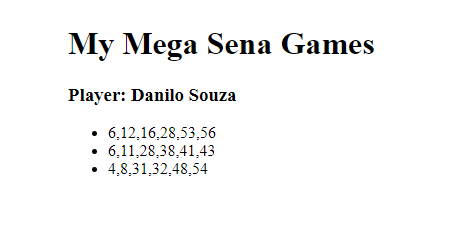

# Welcome to mega-sena-lotery 👋

[](https://mit-license.org)

> Mega sena's brazil lottery | random a list of 6 numbers (between 1 an 60) and set on an ul html element

</img>

## Usage

```sh
just open index.html or execute on liveServer
```

## Author

👤 **Danilo Souza**

* Github: [@DaniloSouza19](https://github.com/DaniloSouza19)
* LinkedIn: [@danilosouzati](https://linkedin.com/in/danilosouzati)

## Show your support

Give a ⭐️ if this project helped you!


## 📝 License

Copyright © 2021 [Danilo Souza](https://github.com/DaniloSouza19).

This project is [MIT](https://mit-license.org) licensed.

***
_This README was generated with ❤️ by [readme-md-generator](https://github.com/kefranabg/readme-md-generator)_